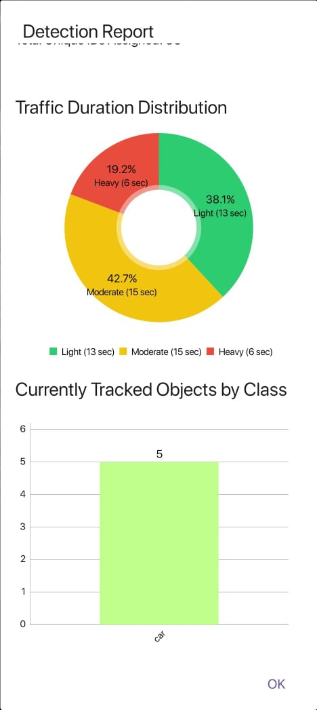
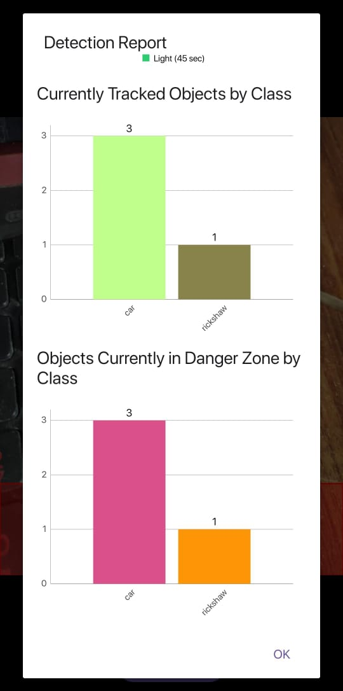
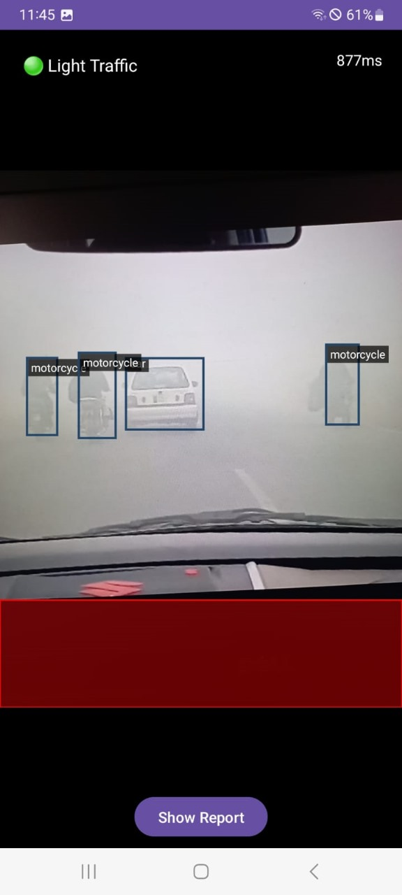
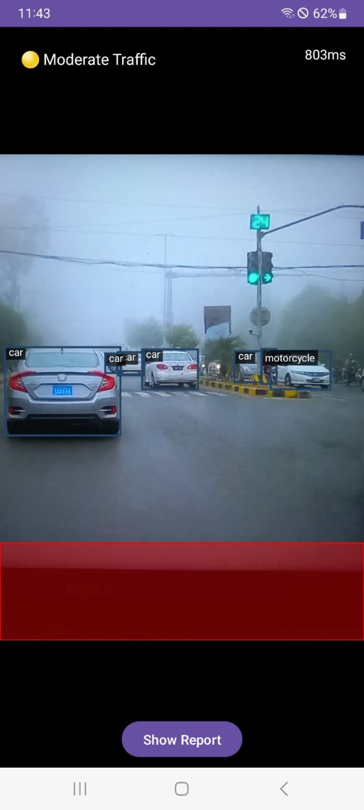

VIGILANTEYE
============

A Real-Time Traffic Object Detection and Alert System for Foggy Weather

📱 Platform: Android  
🧠 Model: YOLOv8n (TFLite)  
🛠 Language: Kotlin  
🎯 Purpose: Enhance road safety by detecting traffic objects in real-time under foggy conditions and alerting drivers.

---

📌 PROJECT OVERVIEW
-------------------
VigilantEye is an offline, on-device Android application built to detect traffic objects in real foggy weather using a lightweight deep learning model (YOLOv8n) optimized with TensorFlow Lite. The app provides real-time alerts using visual cues, audio notifications, and haptic feedback (vibration), enabling drivers to stay safe even in low-visibility environments.

---

🧪 FEATURES
-----------
✅ On-device real-time object detection  
✅ Works in foggy conditions using custom-trained dataset  
✅ Built with YOLOv8n and deployed via TensorFlow Lite  
✅ Visual, audio, and vibration alerts on detection  
✅ Interactive dashboard for statistics and detection reports  
✅ Lightweight and optimized for performance

---

🧰 TECH STACK
-------------
- Frontend: Kotlin (Android)
- ML Model: YOLOv8n trained on a custom dataset (foggy weather)
- Conversion: PyTorch → ONNX → TFLite
- UI/UX: XML Layouts, ViewBinding
- Others: MPAndroidChart (for charts), CameraX (for camera feed)

---

📊 MODEL PERFORMANCE
---------------------
- Model: YOLOv8n (custom-trained on 1600+ foggy images)
- Precision: 0.766
- mAP@50: 0.712
- mAP@50-95: 0.495
- Inference speed: Real-time (~20+ FPS on modern devices)

---

📦 DATASET
-----------
- 1900 real foggy weather images (collected and annotated manually)
- 1548 for training, 181 for validation, 171 for testing
- Annotated using YOLO Labeling Tool

---

📣 ALERT SYSTEM
----------------
- 🔊 Sound Alert: Plays audio warning on detection
- 📳 Vibration: Short pulse when object is nearby
- 👁 Overlay: Visual box and label over detected object

---

📌 HOW TO RUN
-------------
1. Clone this repo and open it in Android Studio
2. Connect an Android device or use emulator
3. Ensure TFLite model and label file are in `assets/`
4. Build and run the app

---

📚 LEARNING OUTCOMES
---------------------
This project helped us:
- Gain confidence in machine learning deployment on mobile
- Understand Android’s CameraX and lifecycle
- Train and convert deep learning models using YOLOv8
- Handle real-time inference with performance optimization
- Develop UI components for statistics and reports
- Improve logic building and debugging skills

---

👨‍💻 AUTHOR
------------
Ahmad Razzaq

---
📸 SCREENSHOTS
--------------

